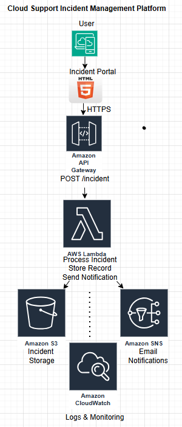
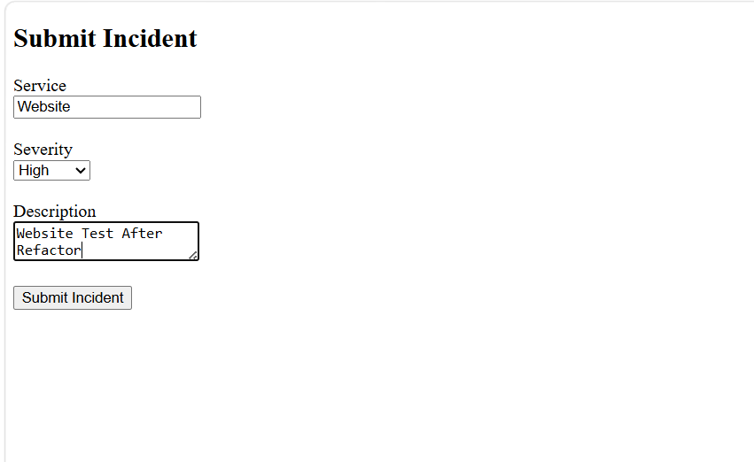
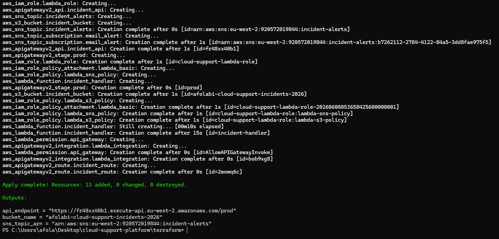
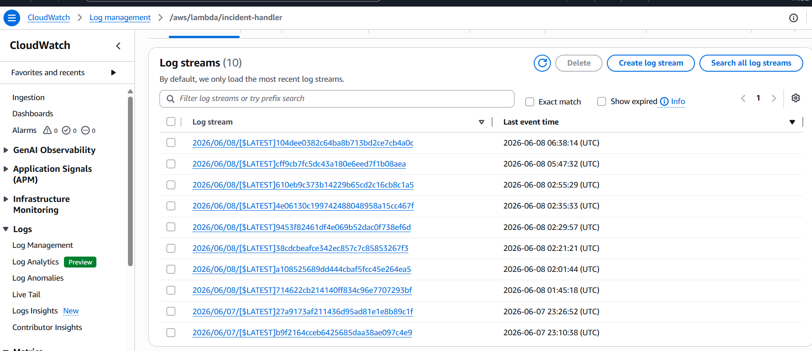
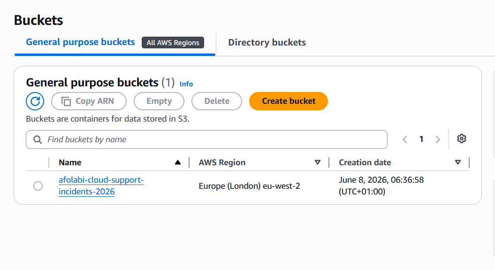
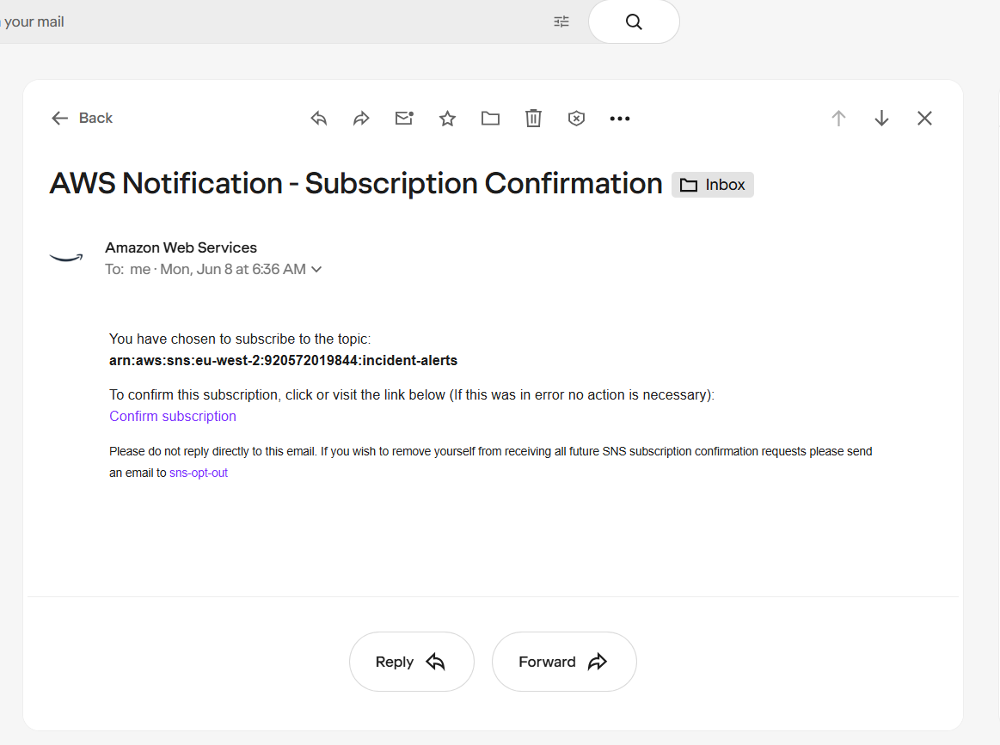

# Cloud Support Incident Management Platform

## Project Overview

This project simulates a lightweight incident management platform that allows users to submit operational incidents through a web interface.

The solution automatically stores incident records, generates notifications, and captures execution logs for auditing and troubleshooting purposes.

The platform was designed to demonstrate practical cloud support and infrastructure engineering skills using AWS, Terraform, Python, and serverless technologies.

---

## Business Problem

Support and operations teams often need a simple way to:

* Record incidents
* Notify stakeholders
* Maintain an audit trail
* Troubleshoot service disruptions

Many organisations rely on ticketing systems and monitoring platforms, but smaller teams may require a lightweight solution that can be deployed quickly and cost-effectively.

This project provides a serverless incident submission workflow using AWS managed services.

---

## Solution Architecture

User submits incident through web portal

Website → API Gateway → AWS Lambda

Lambda performs two actions:

1. Stores incident data in Amazon S3
2. Sends notification through Amazon SNS

CloudWatch captures logs generated during processing.

### Architecture Diagram



---

## AWS Services Used

### Amazon API Gateway

Provides a secure HTTP endpoint that receives incident submissions from the web application.

### AWS Lambda

Processes incoming incident requests and performs backend business logic.

### Amazon S3

Stores incident records as JSON files for auditing and future analysis.

### Amazon SNS

Sends email notifications whenever a new incident is submitted.

### Amazon CloudWatch

Captures Lambda execution logs and supports troubleshooting and operational visibility.

### AWS IAM

Provides least-privilege permissions between services.

---

## Infrastructure as Code

All AWS infrastructure was deployed using Terraform.

Resources provisioned include:

* API Gateway
* Lambda Function
* IAM Roles and Policies
* S3 Bucket
* SNS Topic
* SNS Subscription

This allows the environment to be recreated consistently and destroyed when no longer required.

---

## Frontend

A simple HTML and JavaScript web application provides the incident submission interface.

Users can submit:

* Service Name
* Severity
* Description

Example:

* Service: Payment System
* Severity: Critical
* Description: Checkout unavailable

---

## Screenshots

### Incident Submission Portal



### Terraform Deployment



### CloudWatch Logs



### S3 Incident Storage



### SNS Email Notification



---

## Testing

The platform was tested using:

### Browser Submission

Users submitted incidents through the web portal.

### API Testing

Requests were submitted directly to API Gateway using PowerShell.

Example payload:

```json
{
  "service": "payment-system",
  "severity": "critical",
  "description": "checkout unavailable"
}
```

Successful tests resulted in:

* Incident stored in S3
* Email notification delivered through SNS
* Execution logs recorded in CloudWatch

---

## Challenges Encountered

During development several real-world issues were identified and resolved:

* AWS credential configuration issues
* Terraform resource dependency errors
* SNS notification configuration issues
* API Gateway route configuration
* JavaScript syntax issues
* Browser CORS restrictions
* S3 bucket deletion challenges

Resolving these issues provided valuable cloud troubleshooting experience similar to real support environments.

---

## Future Improvements (Version 2)

Planned enhancements include:

* DynamoDB incident database
* CloudWatch custom metrics
* CloudWatch alarms
* Enhanced incident tracking
* Severity-based alerting
* Operational dashboards

---

## Skills Demonstrated

* AWS
* Terraform
* Infrastructure as Code
* Python
* Serverless Architecture
* CloudWatch Monitoring
* Incident Management Workflows
* API Integration
* IAM Security
* Troubleshooting and Root Cause Analysis
